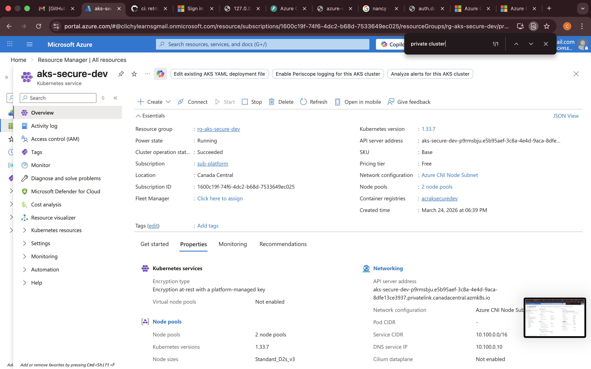
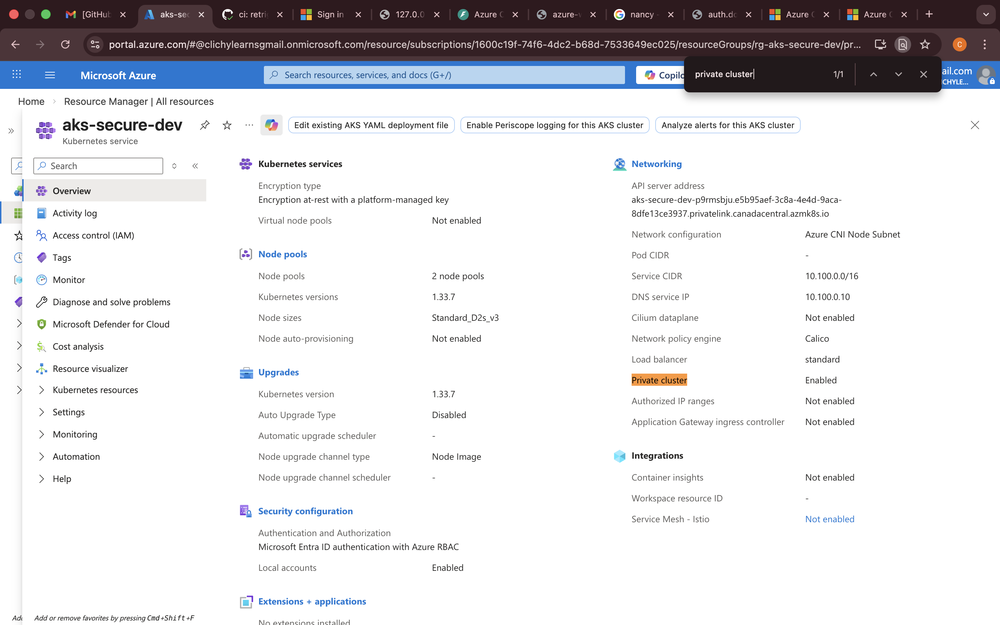
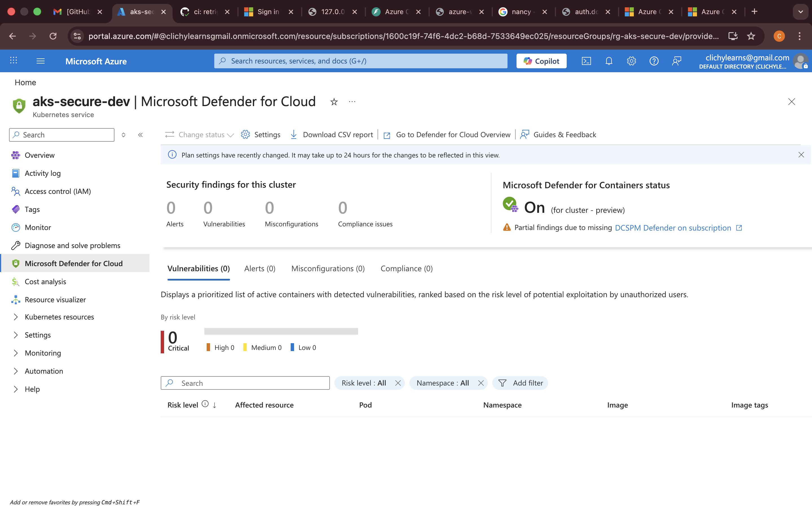
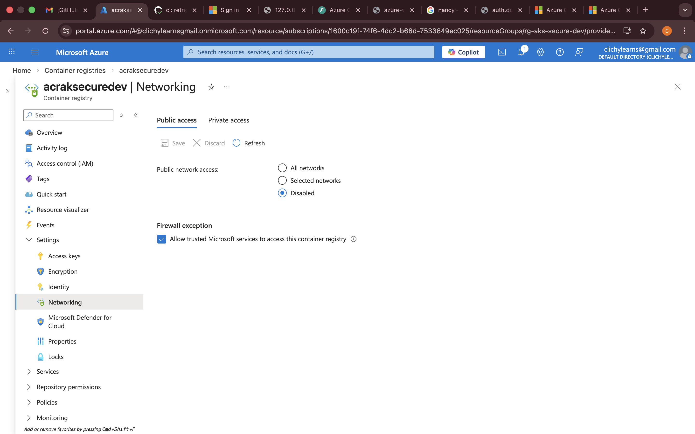
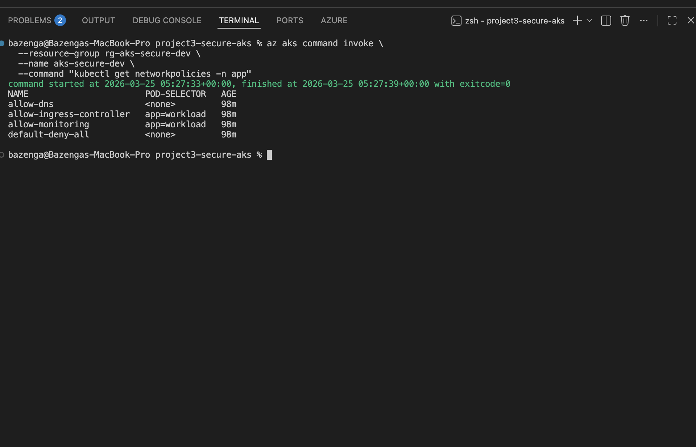
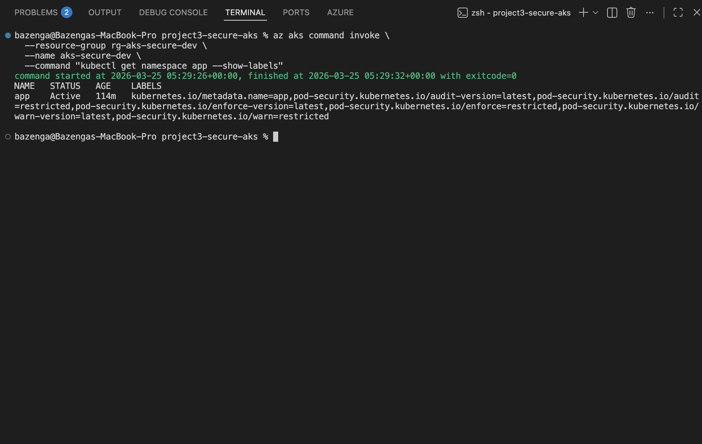
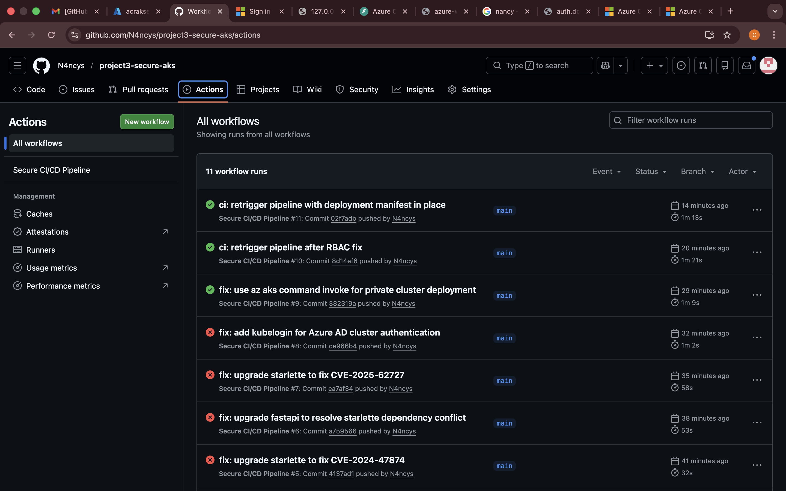
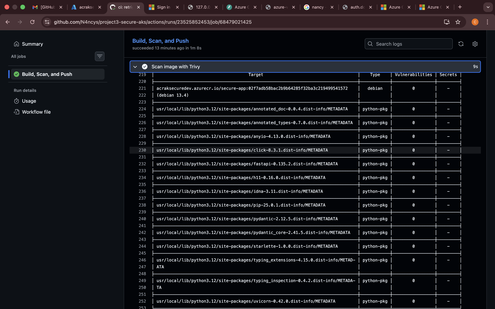

# project3-secure-aks
Secure AKS deployment on Azure using Terraform — private cluster, Calico network policies, Kubernetes RBAC, Workload Identity, Pod Security Standards, Microsoft Defender for Containers, and a GitHub Actions CI/CD pipeline with Trivy image scanning.
# Secure AKS Deployment

 # Project 3 — Secure AKS Deployment on Azure

A production-grade secure Kubernetes deployment on Azure Kubernetes Service (AKS), built with security as the foundation rather than an afterthought. This project demonstrates how to design, deploy, and operate a hardened container platform following industry security standards.

---

## Architecture Overview



The cluster runs inside a private Virtual Network with no public API server endpoint. All components communicate over private networking, and every security control is defined as code using Terraform.

---

## Security Controls

### 1. Private AKS Cluster
The Kubernetes API server has no public IP address. Access is only possible from within the Virtual Network, eliminating an entire class of external attack vectors.



### 2. Microsoft Defender for Containers
Runtime threat detection is enabled at the cluster level, monitoring for suspicious activity across all nodes and namespaces. Security findings are sent to a dedicated Log Analytics Workspace.



### 3. Private Container Registry
Images are stored in Azure Container Registry with public network access disabled. The registry is connected to the cluster VNet via a private endpoint, meaning image pulls never leave the Azure private network.



### 4. Workload Identity
Pods authenticate to Azure services using Workload Identity — no secrets, passwords, or connection strings inside containers. A federated credential bridges the Kubernetes service account to an Azure managed identity using the cluster's OIDC issuer.

### 5. Kubernetes RBAC
Three roles reflect a real team structure:
- **developer** — read-only access to the app namespace
- **ci-deployer** — deploy access for the GitHub Actions pipeline
- **monitoring** — read-only access across all namespaces for Prometheus

### 6. Network Policies
Calico network policies enforce a default-deny posture inside the app namespace. Traffic is explicitly allowed only where needed.



### 7. Pod Security Standards
The app namespace enforces the `restricted` Pod Security Standard — the strictest level available. Pods that attempt to run as root, escalate privileges, or access the host network are rejected before they start.



### 8. CI/CD Pipeline with Security Gates
Every image must pass a Trivy vulnerability scan before it can be pushed to the registry or deployed to the cluster. Critical and high severity vulnerabilities block the pipeline automatically.



During development, Trivy caught a real HIGH severity vulnerability in the starlette package (CVE-2024-47874) and blocked the pipeline until it was fixed — exactly as designed.



---

## Tech Stack

| Category | Technology |
|---|---|
| Cloud | Microsoft Azure |
| Container platform | Azure Kubernetes Service |
| Infrastructure as Code | Terraform |
| Container registry | Azure Container Registry |
| Identity | Azure AD + Workload Identity |
| Network security | Calico network policies |
| Threat detection | Microsoft Defender for Containers |
| Image scanning | Trivy |
| CI/CD | GitHub Actions |
| App framework | FastAPI (Python) |

---

## Project Structure
```
project3-secure-aks/
├── terraform/          # Infrastructure as Code
├── k8s/
│   ├── namespaces/     # Namespace definitions with Pod Security Standards
│   ├── rbac/           # Roles and role bindings
│   ├── network-policies/ # Calico network policies
│   └── workload-identity/ # Service account configuration
├── app/                # Sample FastAPI application
│   ├── Dockerfile
│   ├── app.py
│   └── requirements.txt
└── .github/
    └── workflows/      # CI/CD pipeline with Trivy scanning
```

---

## Related Projects

- [Project 1 — Azure Secure Landing Zone](https://github.com/N4ncys/project1-secure-landing-zone)
- [Project 2 — Cloud Native FastAPI on Azure Container Apps](https://github.com/N4ncys/project2-container-apps)
 
 
 
